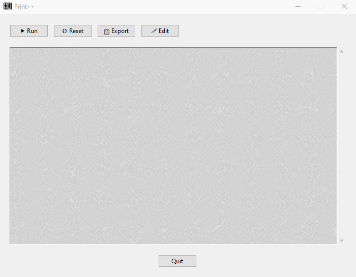

# PrintPlusPlus
The intent behind this project was just a fun way to learn more about the Python programming language and see the output from playing with different python functions/features in a custom made GUI as oppose to the console window.  

## Latest Changes (Sunday, September 09, 2022)
- An edit button is now available allowing you use the software as a basic text editor but also allows you to edit content output from clicking "Run".
- Output from clicking "Run" now appends text to the text area instead of overwriting it.
- Closing the app by clicking the 'X', pressing the 'Quit' button or pressing the ESC key now saves text content to a temp.txt file
## Latest Changes (Sunday July 17, 2022)
- A vertical scrollbar is now available to make seeing text in the output area easier.
## Latest Changes (Sunday July 10, 2022)
- Clicking on the newly added "Export" button allows you to export the content in the text area as a .txt file.
## service.py
The service.py module is meant to be used to contain any desired logic. The return value of the *run* function is what is seen in the Text widget when the "Run" button is clicked.