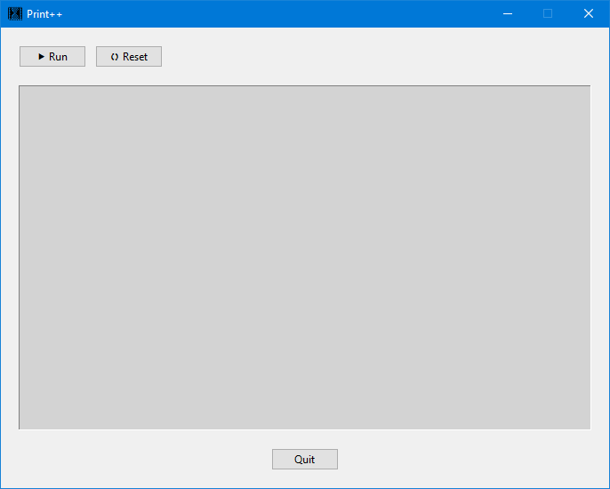

# PrintPlusPlus
The intent behind this project was just a fun way to learn more about the Python programming language and see the output from playing with different python functions/features in a custom made GUI as oppose to the console window.  
